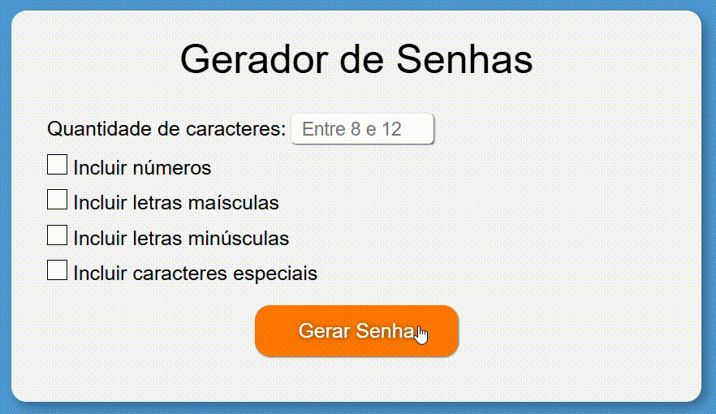

<h1>Gerador de Senhas</h1>

Este projeto foi desenvolvido em HTML, CSS e JavaScript, utilizando Webpack e Babel para garantir compatibilidade entre diferentes navegadores. Ele gera senhas personalizadas de acordo com as configurações selecionadas pelo usuário.

<h2>Tecnologias utilizadas</h2>
<ul>
    <li>HTML5</li>
    <li>CSS3</li>
    <li>JavaScript</li>
    <li>Node.js v20.17.0</li>
    <li>Node Package Manager (npm) v10.8.2</li>
    <li>Webpack v5.98.0</li>
    <li>Babel v7.26.9</li>
    <li>Visual Studio Code v1.98.2</li>
</ul>

<h2>Estrutura das pastas</h2>
<pre>
PASSWORD-GENERATOR/
├── docs/                                    # Contém os arquivos finais do site
│   ├── assets/
│   │   └── js/
│   │       ├── bundle.js                    # Script final do site (gerado via Webpack + Babel)
│   │       └── bundle.js.map                # Mapa de bundle.js (útil para rastreamento e debugging com DevTools)
│   └── index.html                           # Página principal do site
│
├── src/                                     # Contém o código-fonte do projeto
│   └── assets/
│       ├── css/
│       │   └── style.css                    # Arquivo de estilo do projeto (importado e empacotado via css-loader/style-loader)
│       └── js/
│           ├── modules/
│           │   ├── generateChar.js
│           │   └── GeneratePassword.js
│           └── main.js                      # Script principal do projeto que integra todos os módulos
│
├── package-lock.json
├── package.json                             # Informações do projeto e scripts npm
└── webpack.config.js                        # Configuração do Webpack
</pre>

Outros arquivos e pastas foram omitidos por não serem essenciais para o entendimento da estrutura do projeto.

<strong>Nota:</strong> A pasta <code>docs/</code> também é usada para o deploy via GitHub Pages. No entanto, seu conteúdo é fundamental para o funcionamento do projeto, pois contém os arquivos transpilados e empacotados pelo Webpack.

<h2>Funcionalidades</h2>
<ul>
    <li><strong>Compatibilidade com navegadores:</strong> o gerador de senhas funciona corretamente em diferentes navegadores.</li>
     
    <li><strong>Validações:</strong>
        <ul>
            <li>Exibe mensagem de erro se o usuário não digitar um número ou se ele estiver fora do intervalo de 8 a 12.</li>
            <li>Exibe mensagem de erro se nenhuma opção de configuração for selecionada.</li>
        </ul>
    </li>
     
    <li><strong>Criação de senhas personalizáveis:</strong> o usuário pode configurar a senha com os seguintes caracteres:
        <ul>
            <li>Números</li>
            <li>Letras maiúsculas</li>
            <li>Letras minúsculas</li>
            <li>Caracteres especiais</li>
        </ul>
    </li>
</ul>

<h2>Demonstração das funcionalidades</h2>

    

<h2>Como rodar o projeto em seu ambiente</h2>

Para executar este projeto, é necessário ter os seguintes pré-requisitos:

<ul>
    <li><a href="https://nodejs.org/pt" target="_blank">Node.js</a> v20.17.0 ou superior</li>
    <li>Node Package Manager (npm)</li>
</ul>

<strong>Passo a passo:</strong>

<ol>
    <li>Instale o Node.js (se ainda não o tiver): <a href="https://nodejs.org/pt" target="_blank">baixar aqui</a></li>
    <li>Clone o repositório:</li>
    <pre><code>git clone https://github.com/MatheusVenturaNellessen/password-generator.git</code></pre>
    <li>Navegue até a pasta do projeto:</li>
    <pre><code>cd password-generator</code></pre>
    <li>Instale as dependências:</li>
    <pre><code>npm install</code></pre>
    <li>Abra o arquivo <code>index.html</code> dentro da pasta <strong>docs/</strong> em um navegador.</li>
</ol>

Para gerar os arquivos finais novamente após alterações:

<pre><code>npm run build</code></pre>

<h2>Contribuições</h2>

Este projeto está aberto para contribuições via issues. Se você encontrou um bug, deseja sugerir uma melhoria ou tem dúvidas sobre o funcionamento, siga as instruções abaixo:

<ol>
    <li>Verifique se já existe uma issue sobre o assunto. Caso sim, adicione um comentário nela.</li>
    <li>Se não houver, abra uma nova issue com uma descrição clara e objetiva.</li>
</ol>

<h2>Licença e Autor</h2>

Este projeto foi desenvolvido por <a href="https://www.linkedin.com/in/matheus-ventura-nellessen/">Matheus Ventura Nellessen</a> e está licenciado sob a licença MIT. Veja o <a href="./LICENSE">documento</a> para mais detalhes.

