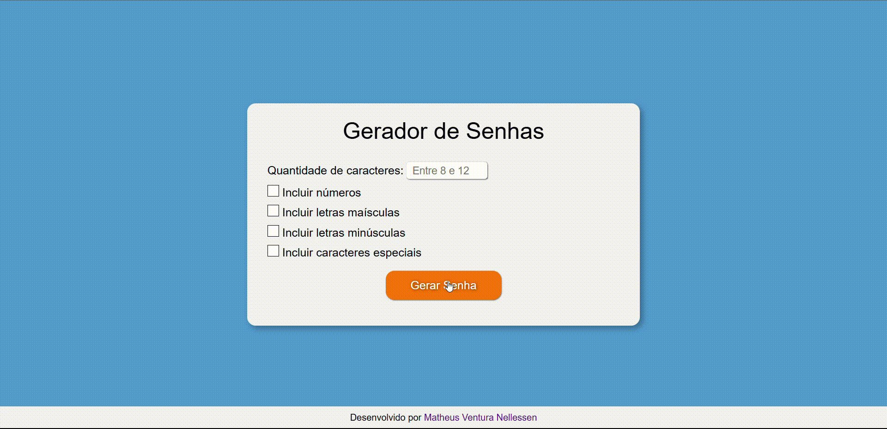

<h1>Gerador de Senhas</h1>

Esse projeto foi desenvolvido em HTML, CSS e JavaScript utilizando Webpack e Babel para garantir compatibilidade entre diferentes navegadores. Ele gera senhas personalizáveis de acordo com opções selecionadas.

<h2>Tecnologias utilizadas</h2>
<ul>
    <li>HTML5
    <li>CSS3
    <li>JavaScript
    <li>Node.js v20.17.0
    <li>Node Package Manager (npm) v10.8.2
    <li>Webpack v5.98.0
    <li>Babel v7.26.9
    <li>Visual Studio Code v1.98.2
</ul>

<h2>Estrutura das pastas</h2>
<pre>
password-generator/
│── docs/                                   # Contém os arquivos finais do site
│   ├── assets/
│   │   ├── js/
│   │   │   ├── bundle.js                   # Script final do site
│   │   │   ├── bundle.js.map               # Mapa de bundle.js
│   ├── index.html                          # Página principal do site
│
│── node_modules/                           # Contém todas as depedências do projeto                  
│
│── src/                                    # Contém o código-fonte do projeto
│   ├── assets/
│   │   ├── css/
│   │   │   ├── style.css                   # Arquivo de estilo do site
│   │   ├── js/                             # Contém os scripts do site
│   │   │   ├── modules/
│   │   │   │   ├── generateChar.js 
│   │   │   │   ├── GeneratePassword.js
│   │   │   ├── main.js                     # Script principal do site que integra todos os módulos
│
│── .gitignore
│── package-lock.json
│── package.json                            # Contém as informações do projeto
│── webpack.config.js                       # Configuração do Webpack
</pre>

<h2>Funcionalidades</h2>
<ul>
    <li><strong>Compatibilidade navegadores</strong>: o gerador de senhas funciona corretamente em diferentes navegadores.
    <li><strong>Validações</strong>:
    <ul>
        <li>Caso o usuário não digite um número ou o número não esteja entre 8 e 12, uma mensagem de erro é exibida.
        <li>Caso o usuário não selecione uma ou mais opções de configurações, uma mensagem de erro informa o usuário.
    </ul>
    <li><strong>Criação de senhas personalizáveis</strong>: o usuário pode configurar a senha gerada com os seguintes caracteres: 
    <ul>
        <li><strong>Números</strong>.
        <li><strong>Letras Maiúsculas</strong>.
        <li><strong>Letras Minúsculas</strong>.
        <li><strong>Caracteres Especiais</strong>.
    </ul>
</ul>

<h2>Demonstração das funcionalidades</h2>

    

<h2>Como rodar o projeto</h2>

Para rodar este projeto, há alguns pré-requisitos:

<ul>
    <li><a href="https://nodejs.org/pt" target="_blank">Node.js</a> v20.17.0 ou superior.
    <li>Node Package Manager (npm).
</ul>

Passo-a-passo:

<ol>
    <li>Instale Node.js: caso não o tenha instalado, baixe-o clicando <a href="https://nodejs.org/pt" target="_blank">aqui</a>.
    <li>Navegue até o repositório pretendido:
    <pre>cd caminho/do/repositorio</pre>
    <li>Clone o repositório:
    <pre>git clone https://github.com/MatheusVenturaNellessen/password-generator.git</pre>
    <li>Instale as depedências:
    <pre>npm install</pre>
    
Uma pasta <strong>node_modules</strong> será criada em seu ambiente com as depedências necessárias do projeto.

    <li>Abra a página principal no navegador:
    <ol>
        <li>Navegue até a pasta <strong>docs</strong> em seu ambiente.
        <li>Abra o arquivo <strong>index.html</strong> num navegador.
    </ol>
</ol>

Para gerar novos arquivos finais, que estarão na pasta <strong>docs</strong>, execute o comando após as alterações:

<pre>npm run build</pre>

<h2>Contribuições</h2>

Este projeto está aberto para contribuições através de issues. Caso você tenha encontrado um bug, queira sugerir uma melhoria ou tenha dúvidas sobre o funcionamento do projeto, por favor, siga as instruções abaixo:

<ol>
    <li>Verifique se já existe uma issue da situação aberta. Se já existir, adicione seu comentário na issue existente.
    <li>Caso não tenha sido aberta, crie uma issue nova.
</ol>

<h2>Autoria</h2>

Desenvolvido por <a href="https://www.linkedin.com/in/matheus-ventura-nellessen/">Matheus Ventura Nellessen</a>.

Sinta-se a vontade para entrar em contato!

